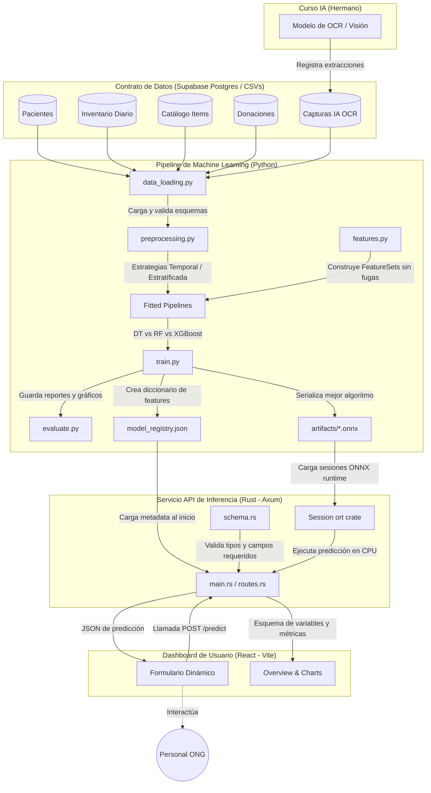

# Arquitectura del Sistema - ALDIMI Predict

ALDIMI Predict está diseñado bajo una arquitectura limpia y desacoplada que separa el entrenamiento pesado (en Python) de la inferencia ágil y segura (en Rust), sirviendo al usuario final a través de una aplicación SPA moderna (React).

---

## 🗺️ Diagrama de Arquitectura de Datos e Inferencia

El siguiente diagrama ilustra el flujo completo de los datos, la exportación de modelos y la interoperabilidad con el curso hermano de Inteligencia Artificial (OCR).

---

## 🤝 Conexión con el Contrato de Datos (Curso de IA Hermano)

La integración con el curso hermano se realiza a través de la tabla `capturas_ia` (representada localmente en [capturas_ia_sinteticas.csv](file:///c:/Users/practicante.coe03/Desktop/Clases/Machine%20Learning/TF/ALDIMI_MachineLearning/datos/capturas_ia_sinteticas.csv)):

1. **Módulo de OCR (Curso IA)**: Recibe recetas físicas o documentos de identidad de los pacientes. Al procesarlos, extrae el texto (campos como medicinas, dosis o nombres) y evalúa la confianza de la extracción.
2. **Registro de Capturas**: Escribe estos resultados en la base de datos Supabase compartida (`capturas_ia`).
3. **Consumo de Machine Learning (Curso ML)**: El pipeline de ML de ALDIMI lee las capturas asociándolas al `paciente_id` para:
   - Medir si la confianza de OCR o la calidad de la imagen influyen en el tiempo de procesamiento o en la prioridad de atención asignada al paciente.
   - Detectar mediante el target `requiere_revision_manual` qué casos requieren asistencia humana, optimizando el tiempo del equipo clínico de la ONG.
